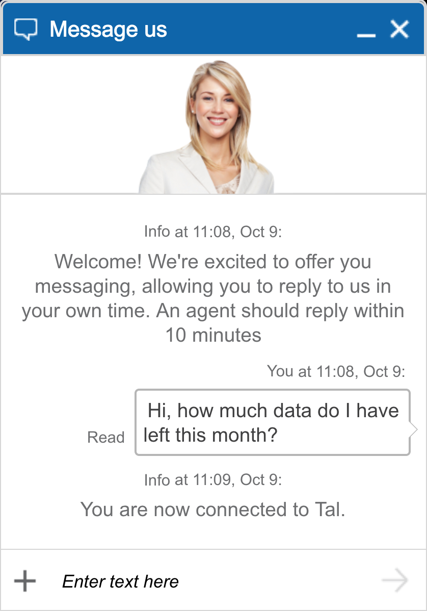
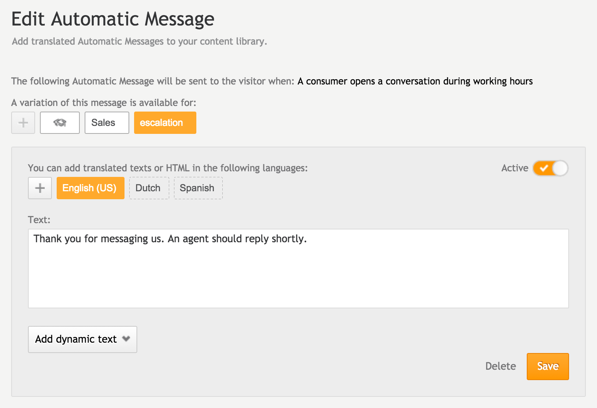

#### Provide consumers with contextual information about the conversation

Automatic, or system, messages are messages that are triggered automatically during a chat or messaging conversation to inform visitors of the status of the conversation. The messages appear to the consumer in the engagement window and to the agent in their agent workspace. For example, when a visitor is connected to an agent, the following message is displayed to the visitor: "Thank you for messaging us. An agent should reply shortly."

Automatic messages support and enhance the conversation between agent and visitor by keeping the visitor engaged and informed without additional effort on the part of the agent. A one-time configuration on your part saves your agents time and provide your visitors with a smoother experience during their conversation.

### Activating automatic messages

Each of the auto messages can be set to be active or inactive. If an auto message is set to be inactive, it will not be sent, even if the event that is meant to trigger it occurs.

### Automatic message per skill

In order to provide a consistent, relevant visitor experience, brands are able to customize automatic messages by skill. This is particularly useful for brands operating across different lines of business and for consumers using different devices or channels to communicate with the brand.

For example, a visitor on a brand’s clothing pages may be greeted with "Thank you for messaging us. One of our fashion consultants will be right with you.", while a visitor to their homeware area will receive the message “Thank you for messaging us. One of our home and garden specialists will be right with you.”

Auto messages can also be disabled for selected skills.

### Multi language support

Automatic messages are supported in all visitor languages. For each message, there is default text for each of the languages, which can be edited. As mentioned above, for each skill the message can also be different for each of the languages.

Automatic messages are available for both chat and messaging. For further information, refer to our documentation:

* [Automatic messages for messaging configuration guide](https://s3-eu-west-1.amazonaws.com/ce-sr/CA/Agent/Automatic+messages+for+messaging.pdf)

* [Automatic messages for chat configuration guide](https://s3-eu-west-1.amazonaws.com/ce-sr/CA/Agent/Automatic+messages.pdf)
